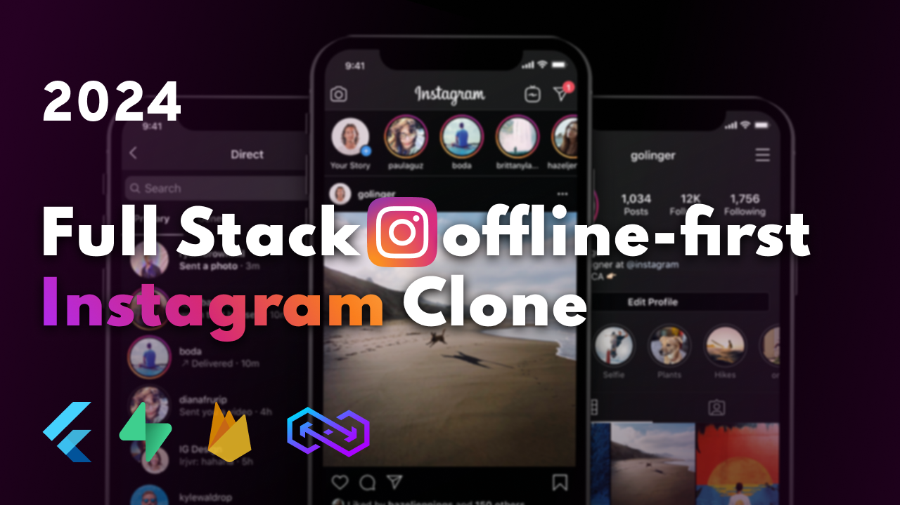

# SocialGram

![coverage][coverage_badge]
[![style: very good analysis][very_good_analysis_badge]][very_good_analysis_link]
[![License: MIT][license_badge]][license_link]

**Made by RWAGENCY**

<div>
<h1><a href="https://youtu.be/xr56AjdGf-o"><strong>Watch complete tutorial »</strong></a></h1>
<a href="https://github.com/Gambley1/flutter_instagram_offline_first_clone/issues/new?assignees=&labels=bug&projects=&template=bug_report.md&title=fix%3A+">Report Bug .</a>
<a href="https://github.com/Gambley1/flutter_instagram_offline_first_clone/issues/new?assignees=&labels=enhancement%2C+feature&projects=&template=feature_request.md&title=feat%3A+">Request Feature</a>
</p>
</div>

## 💫 About The Project

<a href="https://youtu.be/xr56AjdGf-o">
  
</a>

SocialGram is a fully-featured social media application built with Flutter. Made by RWAGENCY, this project showcases a real-world architecture with sleek UI and a high-performance backend. It covers all-in-one features including social feeds, stories, chat messaging, voice messages, video/audio calls, and a comprehensive admin panel.

Whether you're a beginner or experienced developer, SocialGram provides a comprehensive reference for building professional-grade mobile applications.

## ⚡️ Built With

- [Flutter](https://flutter.dev/)
- [Supabase](https://supabase.com/)
- [Firebase](https://firebase.google.com/)

## 🚀 Getting Started

Watch my free complete [**tutorial**](https://youtu.be/xr56AjdGf-o) on my channel!

With a step-by-step explanation, ensuring very smooth watching experience, you will learn to build real-world applications with confidence and no fear!

### ⚠️ Important Notice

**The tutorial was recorded more than 1 year ago**, so some code and Flutter SDK versions may differ from the current repository state.

**📋 For the latest setup instructions and migration guide, please refer to [MIGRATION.md](MIGRATION.md)** which contains:
- Updated Flutter SDK 3.35.7 setup instructions
- FVM (Flutter Version Management) recommendations
- Latest dependency versions and breaking changes
- Step-by-step migration guide from older versions
- Supabase database setup instructions

### 🗄️ Supabase Setup

1. Create a [Supabase project](https://supabase.com/dashboard)
2. Copy the entire SQL file from [`supabase/complete_schema.sql`](supabase/complete_schema.sql)
3. Paste it in **SQL Editor** → **New Query** → Click **Run**
4. Create an auth user, then run:
   ```sql
   UPDATE auth.users SET app_metadata = '{"role": "admin"}' WHERE email = 'your-email@example.com';
   ```
5. Copy `.env.example` → `.env` and fill in your credentials

### ☁️ Cloudinary Setup (Free Tier)

1. Create a [Cloudinary account](https://cloudinary.com/users/register)
2. Note your **Cloud Name** from the dashboard
3. Create an upload preset named `socialgram_uploads` (unsigned)
4. Add `CLOUDINARY_CLOUD_NAME` and `CLOUDINARY_UPLOAD_PRESET` to your `.env` file

See [`supabase/README.md`](supabase/README.md) for detailed instructions.

## ⭐️ Contributing

Contributions are what make the open source community such an amazing place to learn, inspire, and create. Any contributions you make are **greatly appreciated**.

If you have a suggestion that would make this better, please fork the repo and create a pull request. You can also simply open an issue with the tag "enhancement".
Don't forget to give the project a star! Thanks again!

1. Fork the Project
2. Create your Feature Branch (`git checkout -b feature/AmazingFeature`)
3. Commit your Changes (`git commit -m 'Add some AmazingFeature'`)
4. Push to the Branch (`git push origin feature/AmazingFeature`)
5. Open a Pull Request

## 📝 License

Distributed under the MIT License. See [MIT License](https://opensource.org/licenses/MIT) for more information.

## 💭 Contact

**Made by RWAGENCY**

- Twitter - [@Emil Zulufov (ezIT)](https://twitter.com/EmdyEmil)
- Email - emilzulufov.commercial@gmail.com

Project Link: [https://github.com/Gambley1/flutter_instagram_offline_first_clone](https://github.com/Gambley1/flutter_instagram_offline_first_clone)

## 🎯 Acknowledgments

This tutorial is highly inspired by a very popular Flutter News toolkit, make sure to check it out!

And you can watch my blog on medium.

- [flutter_news_toolkit](https://flutter.dev/news)
- [medium blog](https://medium.com/@emilzulufov566/become-flutter-successful-developer-in-days-1bb4ef47b305)

## ☕️ Support

Also, I would really appreciate any of your support! You can buy me a coffee and become a part of our beautiful community.

Your donation will hugely help me and it will allow me to keep the next beautiful videos and tutorials high-quality and free!

- [Ko-fi](https://kofi.com/emilzulufov)
- [PayPal](https://paypal.me/emilzulufov)

[coverage_badge]: coverage_badge.svg
[license_badge]: https://img.shields.io/badge/license-MIT-blue.svg
[license_link]: https://opensource.org/licenses/MIT
[very_good_analysis_badge]: https://img.shields.io/badge/style-very_good_analysis-B22C89.svg
[very_good_analysis_link]: https://pub.dev/packages/very_good_analysis